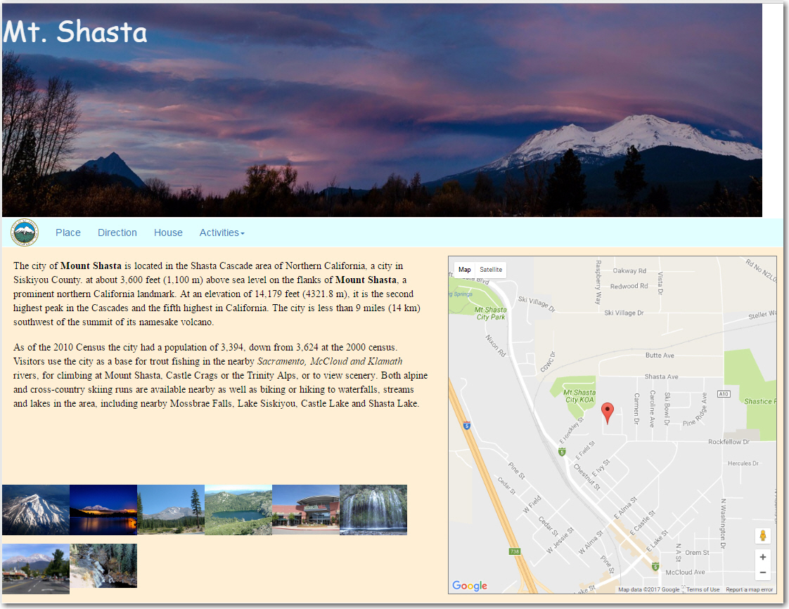
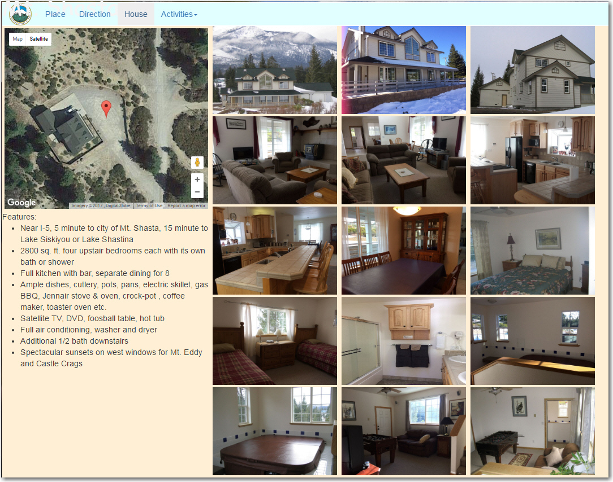
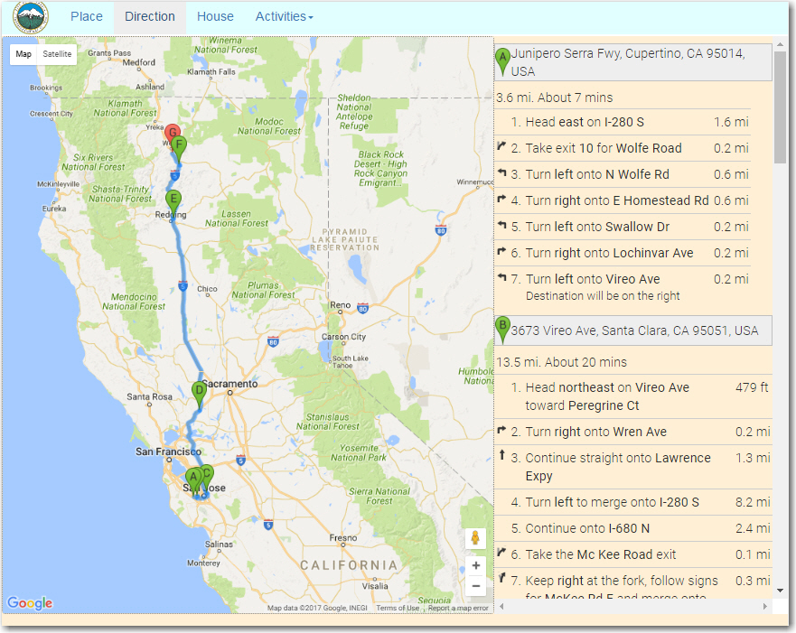

These pages are used for planning a tour for the upcoming trip to Mt. Shasta in northern
California.

First tab provides a general introduction of the area.  A total of four
families will participate, a tab called "direction" shows on the map
about the driving directions, another tab called "House" displays the
luxury rental home.  Last tab called "Activites" outline what we plan
to do each day.

<u>Note</u> each image can be clicked to pop up the larger version.

 
 
 

Here is the live link https://mt-shasta.herokuapp.com/
